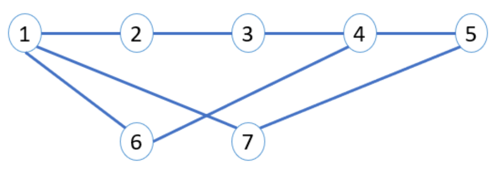

# Documentation : PA-3 Link State Protocol

## How to compile and run the code

1. Compilation: `mvn compile assembly:single`
2. Initializing a router (adjust the router config file at the end accordingly): `java -cp target/COMP535-1.0-SNAPSHOT-jar-with-dependencies.jar socs.network.Main conf/router[1-7].conf`

## Testing (Using Handout Example)

In order to test the layout provided within the handout, it is recommended to have have **7 open terminals** since we will need to configure **7 different routers**.

We divide the following section based on what you should be running in each terminal:

**Initiallizing Routers:** Use the same command per terminal but adjust the configuration file accordingly (ex: router1.conf, router2.conf, ..., router7.conf). You will see the **process Port number + simulated IP Address for each**.

Routers 1-7 have simulated addresses and ports; X is the number that is different for each according to router number (i.e. 1 to 7):

```
socs.network.router.ip="192.168.1.X"
socs.network.router.port=300X
```

- **TERMINAL 1:** `java -cp target/COMP535-1.0-SNAPSHOT-jar-with-dependencies.jar socs.network.Main conf/router1.conf`
- **TERMINAL 2:** `java -cp target/COMP535-1.0-SNAPSHOT-jar-with-dependencies.jar socs.network.Main conf/router2.conf`
- **......**
- **TERMINAL 7:** `java -cp target/COMP535-1.0-SNAPSHOT-jar-with-dependencies.jar socs.network.Main conf/router7.conf`

**Connecting Routers (attach and start):** By following the same diagram provided in the handout we need to run the following (after initializing routers):


- **TERMINAL 1:**
  - `connect 127.0.0.1 3002 192.168.1.2`
  - `connect 127.0.0.1 3006 192.168.1.6`
  - `connect 127.0.0.1 3007 192.168.1.7`
- **TERMINAL 2:**
  - `connect 127.0.0.1 3003 192.168.1.3`
- **TERMINAL 3:**
  - `connect 127.0.0.1 3004 192.168.1.4`
- **TERMINAL 4:**
  - `connect 127.0.0.1 3005 192.168.1.5`
  - `connect 127.0.0.1 3006 192.168.1.6`
- **TERMINAL 5:**
  - `connect 127.0.0.1 3007 192.168.1.7`

**Neighbors:** You can run `neighbors` in any terminal to see the attached routers:
For example, in terminal 1 (Router 1):

```
>> neighbors

  Port  IP address
  3002  192.168.1.2
  3006  192.168.1.6
  3007  192.168.1.7
```

**Shortest Distance:** To find the shortest distance from any router to any other router simply call the `detect` command.
For example, from **Terminal 1 (Router 1)** we detect for router 5:

```
>> detect 192.168.1.5
192.168.1.1 -> 192.168.1.7 -> 192.168.1.5
```

As expected, it chooses the shortest path through router 7 instead of going through 6-4 nor routers 2-4.

**Disconnecting A Router:**
We use scenarios similar to those described in the handout.

- **Router 7 Disconnects from Router 1**:

  - Call `disconnect 192.168.1.1` from Terminal 7.
  - Call `neighbors` from **Terminal 5** to see if 7 is still (it should be!)
  - Try calling `detect 192.168.1.5` from **Terminal 1** again now:

- **Router 6 Disconnects from Network**:
  - Call `disconnect 192.168.1.1` from Terminal 7.
  - Try calling `detect 192.168.1.5` from **Terminal 1** again now:

## `attach` Command

- We implemented the attach request handler.
- When you use the attach command to attach a router to another router, you need to confirm the request manually
  by typing "Y | y" or "N | n" on the other router's console.
- However, if another router has reached the maximum number of ports (4) available, your attach request will be rejected
  automatically.
- After the request is accepted, you can use the start command to start the router which will start the LSD
  synchronization process.

## `connect` Command (Important)

- Since the connect command is just a combination of an attach command followed by a start command, you still need to
  confirm this request from the other router which you are connecting to. It works exactly the same way as the attach
  command described above, except that you don't need to type start command anymore. It will trigger the LSD
  synchronization directly **after** the request is confirmed.
- It is tricky that LSD update packets must be sent only **after** the request is accepted on the other router. We used
  java thread blocking synchronization technique to achieve this. Specifically, we used the monitor and condition
  variable make thread wait and notify each other. See the code in `socs.network.node.Router.java` for more details.

## `detect` Command (Important)

- **Checks**:The processDetect method checks whether the passed simulated IP address is the same as the current router's simulated IP address and outputs an error message if so.
- **Shortest Path**: The processDetect method calls a helper method from the local instance of LinkStateDatabase that finds the shortest path.
  - The shortest path method is implemented within the LinkStateDatabase class and returns the string representation of the shortest path based on Djisktra's Algorithm
- **Dijsktra's Algorithm: Data Structures**: These include:
  - Distance Map (dist): This map stores the shortest known distance from the source router to every other router in the network. Initially, all distances are set to Integer.MAX_VALUE (representing infinity), except for the source router itself, which is set to 0.
  - Predecessor Map (prev): This map keeps track of the previous router in the optimal path from the source. This helps in reconstructing the path once the shortest path has been found.
  - Priority Queue (pq): A priority queue that orders routers based on their shortest known distance. It helps in selecting the next router to process in an efficient manner.
- **Dijsktra's Algorithm: Procedure**:
  - Add all routers to the priority queue with their initial distances (infinity for all except the source).
  - While the priority queue is not empty, dequeue the router with the smallest distance (currentIP).
    - If the dequeued router is the destination, or if the smallest distance is infinity, stop the process (as this means the destination is reached or unreachable).
  - For each neighbor of the currentIP, calculate the distance through currentIP to see if it offers a shorter path than previously known.
    - If a shorter path is found, update the neighbor's distance in the dist map and adjust its position in the priority queue.
  - Starting from the destination IP, use the prev map to backtrack and reconstruct the path by stepping through each router on the optimal route until the source is reached.
  - Convert the path into a readable string format, e.g., "source IP -> ... -> destination IP".
  - If the destination remains unreachable after the algorithm completes (indicated by its distance still being infinity), return "No path found".

## `disconnect` Command (Important)

- **Checks:** We do some checks if portNumber is in a valid range and if there is a link for that port.
- **Link & LSA Update:**
  - Removes the neighbor's link description from the router's own Link State Advertisement (LSA) in the LinkStateDatabase since the link no longer exists.
  - Updates the neighbor’s LSA by removing the link description of this router from the neighbor's LSA
- **Broadcast Update:** After updating the LSAs, broadcasts an LSA update packet to all neighbors. This broadcast uses the broadcastPacket method with the type set to LSAUPDATE, signaling an update to the Link State Database, ensuring that all neighbors are informed of the change.
- **Removing the Link:** Link at the specified port is then set to null, thus disconnecting the router from the neighbor at that port. We also adjust the AttachRequestStatus and ports array accordingly (cleanup).
- **Note:** resetting the neighbor's status (before setting array entry itself to null) is necessary because the lifetime of this RouterDescription instance is the same as the router's lifetime, and this connection might be re-established in the future

## `quit` Command

processQuit method in the Router class handles the proper shutdown of the router (disconnecting from all neighbors + terminating all processes associated with the router)

- **Terminate Packet Listener**

  - Stops the `PacketListener` thread that handles incoming packets. This is critical to prevent any new network traffic from being processed during the shutdown.

- **Update Link State Database**

  - Iterates through all ports and removes link descriptions from the `LinkStateDatabase` (LSD) for all connected neighbors. This update is essential to ensure that the router’s state is correctly reflected in the network topology before shutting down.
  - For each connected neighbor, it also updates the neighbor's LSD by removing the link description related to this router.

- **Broadcast LSA Update**

  - After updating the LSD, broadcasts an LSA update packet to all neighbors. This step is crucial to ensure that all remaining routers in the network are aware of the topology changes due to this router's shutdown.
  - The broadcast uses the `broadcastPacket` method with the type set to LSAUPDATE, indicating an update to the Link State Database.

- **Disconnect All Links**

  - Loops through each port and removes the attached link, effectively disconnecting from all neighbors. This ensures that no residual connections are left that might incorrectly suggest the router is still active in the network.

- **Terminate the Program**
  - Calls `System.exit(0)` to terminate the entire program, ensuring that all remaining threads and processes are cleanly stopped.

## Some Examples:

- Attach router1 to router2:
  - type `attach 127.0.0.1 3002 192.168.1.2` on router1's console
- Attach router2 to router3:
  - type `attach 127.0.0.1 3003 192.168.1.3` on router2's console
- Connect router1 to router2:
  - type `connect 127.0.0.1 3002 192.168.1.2` on router1's console
- Disconnect router2 from router1:
  - type `disconnect 192.168.1.2` on router1's console
